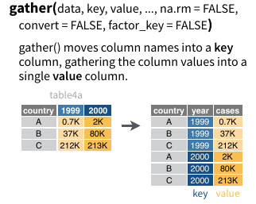
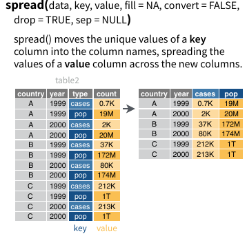
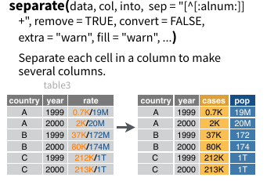
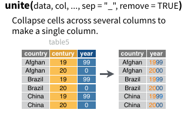

```{r setup, include=FALSE}
options(htmltools.dir.version = FALSE)

knitr::opts_chunk$set(fig.height = 4, message = F, warning = F)
```

## Install required packages

```{r, eval = F}
# Load the ggplot2 package
install.packages("ggplot2")
install.packages("magrittr") # important so that we can use %>%!
install.packages("gapminder")
install.packages("dplyr")
```

## Load required packages

```{r}
# Load the ggplot2 package
library(ggplot2)
library(magrittr) # important so that we can use %>%!
library(gapminder)
library(dplyr)
```

---

### Explore the mtcars data frame with `head()`
```{r, echo = F}

knitr::kable(head(mtcars), format = "html")
```

---

### Explore the mtcars data frame with `str()`

```{r}

str(mtcars)
```

---

### Build a simple plot

```{r}

ggplot(mtcars, aes(x = cyl, y = mpg)) +
  geom_point()
```

---

### Axes aesthetics

```{r}
ggplot(mtcars, aes(x = wt, y = mpg)) +
  geom_point()
```

---

### Color aesthetics

```{r}
ggplot(mtcars, aes(x = wt, y = mpg, color = disp)) +
  geom_point()
```

---

### Size aesthetics

```{r}
ggplot(mtcars, aes(x = wt, y = mpg, size = disp)) +
  geom_point()

```

---

### One common error to avoid

```{r, eval = F}
ggplot(mtcars, aes(x = wt, y = mpg, shape = disp)) +
  geom_point()

```

--
```{r}

table(mtcars$disp)
```

--

The _types_ of variables (i.e. columns) are important
---

### Let's look at another dataset

```{r}
# Explore the diamonds data frame with str()
str(diamonds)
```

---

###  We can build up a new plot following the same 'recipe' every time

+ add data (diamonds)

--

+ specify aesthetics (x axis and y axis inside `aes`)

--

+ add a geom object (`geom_point`)

--

```{r}
# Add geom_point() with +
ggplot(diamonds, aes(x = carat, y = price))  +
  geom_point()
```

---

### We can layer additional `geoms` one after another

```{r}
# Add geom_point() and geom_smooth() with +
ggplot(diamonds, aes(x = carat, y = price)) +
  geom_point() +
  geom_smooth()
```

---

### Let's recreate that plot

```{r, echo = F}
# 1 - The plot you created in the previous exercise
ggplot(diamonds, aes(x = carat, y = price)) +
  geom_point() +
  geom_smooth()
```

--

```{r, eval = F}
# 1 - The plot you created in the previous exercise
ggplot(diamonds, aes(x = carat, y = price)) +
  geom_point() +
  geom_smooth()
```

---

### Plotting only the trend-line

```{r, echo = F}
# 2 - Copy the above command but show only the smooth line
ggplot(diamonds, aes(x = carat, y = price)) +
  geom_smooth()
```

--

```{r, eval = F}
# 2 - Copy the above command but show only the smooth line
ggplot(diamonds, aes(x = carat, y = price)) +
  geom_smooth()
```

---

### Plotting separate lines for each diamond clarity value

```{r, echo = F}
# 3 - Copy the above command and assign the correct value to col in aes()
ggplot(diamonds, aes(x = carat, y = price, color = clarity)) +
  geom_smooth()
```

--

```{r, eval = F}
# 3 - Copy the above command and assign the correct value to col in aes()
ggplot(diamonds, aes(x = carat, y = price, color = clarity)) +
  geom_smooth()
```

---

### Color points by clarity

```{r, echo = F}
# 4 - Keep the color settings from previous command. Plot only the points with argument alpha.
ggplot(diamonds, aes(x = carat, y = price, color = clarity)) +
  geom_point(alpha = 0.4)
```

--

```{r, eval = F}
# 4 - Keep the color settings from previous command. Plot only the points with argument alpha.
ggplot(diamonds, aes(x = carat, y = price, color = clarity)) +
  geom_point(alpha = 0.4)
```

---

### plots can be created in two different steps using the `+` symbol

```{r}
# Create the object containing the data and aes layers: dia_plot
dia_plot <- ggplot(diamonds, aes(x = carat, y = price))

# Add a geom layer with + and geom_point()
dia_plot + geom_point()
```
---

### aesthetics can be 'scoped' to a specific `geom` object

```{r}
# Add the same geom layer, but with aes() inside
dia_plot + geom_point(aes(color = clarity))
```

---

### Basic scatter plot

```{r, echo = F}
# 2 - Expand dia_plot by adding geom_point() with alpha set to 0.2
dia_plot <- dia_plot + geom_point(alpha = 0.2)
print(dia_plot)
```

--

```{r, eval = F}
# 2 - Expand dia_plot by adding geom_point() with alpha set to 0.2
dia_plot <- dia_plot + geom_point(alpha = 0.2)
print(dia_plot)
```

---

### Plot trendlines per group

```{r, echo = F}
# 3 - Plot dia_plot with additional geom_smooth() with se set to FALSE
dia_plot + geom_smooth(se = FALSE)
```

--
```{r, eval = F}
# 3 - Plot dia_plot with additional geom_smooth() with se set to FALSE
dia_plot + geom_smooth(se = FALSE)
```

* `se` allows to specify confidence intervals

---

### Plot trendline by clarity

```{r, echo = F}
# 4 - Copy the command from above and add aes() with the correct mapping to geom_smooth()
dia_plot + geom_smooth(aes(col = clarity), se = FALSE)
```
--
```{r, eval = F}
# 4 - Copy the command from above and add aes() with the correct mapping to geom_smooth()
dia_plot + geom_smooth(aes(col = clarity), se = FALSE)
```


---

# _Base R_ plotting

---

#### take a look at built-in `iris` dataset

```{r}
knitr::kable(head(iris), format = "html")
```

---

### a simple base R plot

```{r}
plot(iris$Sepal.Length, iris$Sepal.Width)
points(iris$Petal.Length, iris$Petal.Width, col = "red")
```

---

### Limitations of Base Plotting

1. Plot doesn't get redrawn (this is similar to `matplotlib` in python)

2. Plot is drawn as an image

3. Need to manually add legend

4. No unified framework for plotting

---

### More about Base plots

```{r}
# Plot the correct variables of mtcars
plot(mtcars$wt, mtcars$mpg, col = mtcars$cyl)
```

---

### More about Base plots

```{r}
# Change cyl inside mtcars to a factor
mtcars$fcyl <- as.factor(mtcars$cyl)

# Make the same plot as in the first instruction
plot(mtcars$wt, mtcars$mpg, col = mtcars$fcyl)
```

---
### More about Base plots

```{r}
# Use lm() to calculate a linear model and save it as carModel
carModel <- lm(mpg ~ wt, data = mtcars)

# Basic plot
mtcars$cyl <- as.factor(mtcars$cyl)
plot(mtcars$wt, mtcars$mpg, col = mtcars$cyl)

# Call abline() with carModel as first argument and set lty to 2
abline(carModel, lty = 2)
```

---

### The same plot using `ggplot2`

```{r}
# Plot 1: add geom_point() to this command to create a scatter plot
ggplot(mtcars, aes(x = wt, y = mpg, col = cyl)) +
  geom_point()
```

---

### The same plot using `ggplot2`

```{r}
# Plot 2: include the lines of the linear models, per cyl
ggplot(mtcars, aes(x = wt, y = mpg, col = cyl)) +
  geom_point() +
  geom_smooth(aes(group = 1), method = "lm", se = FALSE, linetype = 2)
```

---

### The same plot using `ggplot2`

```{r}
# Plot 3: include a lm for each group in the dataset
ggplot(mtcars, aes(x = wt, y = mpg, col = cyl)) +
  geom_point() +
  geom_smooth(method = "lm", se = FALSE) +
  geom_smooth(aes(group = 1), method = "lm", se = FALSE, linetype = 2)
```

---

# Let's talk about _tidy_ data!


```{r, echo = F, results = 'hide'}
knitr::kable(head(iris), format = "html")

iris_sepal <- dplyr::select(iris, -Petal.Length, -Petal.Width) %>% 
  dplyr::mutate(Part = "Sepal") %>% 
  dplyr::rename(Width = Sepal.Width, Length = Sepal.Length)

iris_petal <- dplyr::select(iris, -Sepal.Length, -Sepal.Width) %>% 
  dplyr::mutate(Part = "Petal") %>% 
  dplyr::rename(Width = Petal.Width, Length = Petal.Length)

iris.long <- dplyr::bind_rows(iris_petal, iris_sepal)


```

### ggplot2 usually works with _tidy_ data

There are three interrelated rules which make a dataset tidy:

    Each variable must have its own column.
    Each observation must have its own row.
    Each value must have its own cell.


---

###  two types of data: 'wide' and 'long'

```{r, echo = F}
knitr::kable(head(iris), format = "html")

knitr::kable(head(iris.long), format = "html")
```

* tidy Data is usually 'long'

---

### Tidy data makes code cleaner and therefore more reliable

```{r, eval = F}
# Option 1
ggplot(iris, aes(x = Sepal.Length, y = Sepal.Width)) +
  geom_point() +
  geom_point(aes(x = Petal.Length, y = Petal.Width), col = "red")

# Option 2
ggplot(iris.long, aes(x = Length, y = Width, col = Part)) +
  geom_point()

```
---

### Advantages of ggplot in comparison to base

1. The legend gets taken care of 

2. The axis labels are legible

3. The plot can be __iterated on__

---

### So how we make data tidy?

--

## Use `tidyr` and `dplyr`!

```{r, eval = F}
install.packages("nycflights13")
install.packages("tidyr")
```

```{r}
library(tidyr)
library(nycflights13)
```

---

### Gather



---

### Gather

```{r}
ds <- nycflights13::airports %>% 
  gather(lat, lon, key = "coordinate", value = "value")
```


```{r, echo = F}
knitr::kable(head(ds), format = "html")
```


---

### Spread



---

### Spread

```{r}
ds <- ds %>% 
  tidyr::spread(coordinate, value, c("lat", "lon"))
```


```{r, echo = F}
knitr::kable(head(ds), format = "html")
```


---

### Separate



---

### Separate

```{r}
ds2 <- nycflights13::airports %>% 
  tidyr::separate(tzone, into = c("country", "city"), sep = "/")
```


```{r, echo = F}
knitr::kable(head(ds2), format = "html")

```


---

### Unite



---

### Unite

```{r}
ds2 <- ds2 %>% 
  tidyr::unite(country, city, col = "tzone", sep = "/")
```


```{r, echo = F}
knitr::kable(head(ds2), format = "html")
```

---

### Modifying aesthetics

+ everything in `aes` is an aesthetic mapping (this includes x-axis and y-axis)

+ we can modify these `aes` with some specific options 

+ let's modify the x-axis aesthetic!

```{r, echo = F, results = 'hide'}
library(patchwork)

cyl.am <- ggplot(mtcars, aes(x = factor(cyl), fill = factor(am)))

# The base layer, cyl.am, is available for you
# Add geom (position = "stack" by default)
stplot <- cyl.am + 
  geom_bar()

# Fill - show proportion
fillplot <- cyl.am + 
  geom_bar(position = "fill")

# Dodging - principles of similarity and proximity
dodgeplot <- cyl.am +
  geom_bar(position = "dodge") 

```

+ standard position
+ `fill` position (proportional)
+ `dodge` position (horizontally stacked position)

```{r, echo = F}
stplot + fillplot + dodgeplot
```

---

# Other Types of Plots

### Load Data 

```{r}
gm_2007 <- gapminder %>%
  filter(year == 2007)

```

--

###  Load (More) Data

```{r, }
by_year_continent <- gapminder %>%
  group_by(year, continent) %>%
  summarize(totalPop = sum(pop),
            meanLifeExp = mean(lifeExp))

```

---

# Line plots

change over time

--

```{r}
ggplot(by_year_continent, aes(x = year, y = totalPop, color = continent, height = 3)) +
  geom_line() + #<<
  expand_limits(y = 0)
```

---

# Bar plots

comparing over several categories

--

```{r, echo = F}

by_continent <- gapminder %>%
  group_by(continent) %>%
  summarize(meanLifeExp = mean(lifeExp, na.rm = T)) %>%
  identity()

```

```{r}
ggplot(by_continent, aes(x = continent, y = meanLifeExp)) +
  geom_col() #<<

```

---

# histograms

distribution of a single numeric variable

--

```{r}
ggplot(gm_2007, aes(x = lifeExp)) +
  geom_histogram() #<<
```

---

# It's important to manage the binwidth of a histogram

```{r}
ggplot(gm_2007, aes(x = lifeExp)) +
  geom_histogram(binwidth = 5) #<<
```

---

# box plots

distribution of several numeric variables

--

```{r}
ggplot(gm_2007, aes(x = continent, y = lifeExp)) +
  geom_boxplot() #<<
```

---

# Histogram vs Box Plot

.pull-left[
```{r}
hist_plot <- ggplot(gm_2007, aes(x = lifeExp)) +
  geom_histogram() #<<

hist_plot
```
]

.pull-right[
```{r}
ggplot(gm_2007, aes(x = continent, y = lifeExp)) +
  geom_boxplot() #<<
```
]

---

# How to Print to a File

### Three ways:

--

### ggsave

--

### graphicsdevice

--

### manual

---

# ggsave

#### ggsave defaults to the last printed plot

```{r}
ggsave("test_histogram.pdf")
```

#### otherwise you can specify a plot object as the second argument

```{r}
ggsave("test_histogram2.pdf", plot = hist_plot)
```

---

# graphicsdevice (pdf, png, jpg, etc.)

#### *Warning* The plot needs to be *printed*, not just created within the graphics device

```{r}
 
pdf("test_histogram3.pdf")
hist_plot
dev.off()
```

---

# Manually

```{r}
# can use the rstudio viewer pane
print(hist_plot)
```


