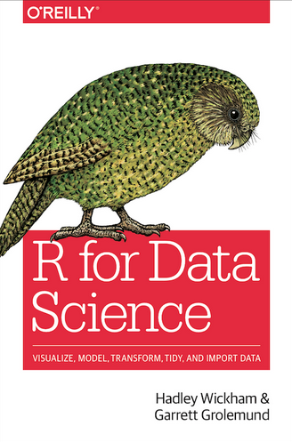

```{r setup, echo = F}
knitr::opts_chunk$set(warning = F, message = F, fig.height = 4)
```

# Resources

.pull-left[
<span style="font-size: 200%">[R for Data Science](https://r4ds.had.co.nz/)</span>

<span style="font-size: 200%">[rstudio cheat sheets](https://www.rstudio.com/resources/cheatsheets/)</span>
]

.pull-right[

]

---

# Data Science Workflow


---

# Load Packages

```{r}
library(dplyr)
library(ggplot2)
library(gapminder)
```

---

# Load Data 

```{r}
gm_2007 <- gapminder %>%
  filter(year == 2007)

gm_2007
```

---

#  Relationship between wealth and life expectancy

```{r}
ggplot(gm_2007, aes(x = gdpPercap, y = lifeExp)) +
geom_point()
```

---

# Parts of a Plot

```{r, eval = F}
ggplot(gm_2007, aes(x = gdpPercap, y = lifeExp)) +
geom_point()
```

--

* `aes` stand for 'aesthetic'--general term for settings that affect the display of a plot

--

* here we specify the x and y axes in the `aes` argument

--

* use `+` to add 'layers' to the graph

--

* `geom` stands for 'geometric object'

--

* `geom_point` means 'make a scatterplot'

---

#  Using a log scale

```{r}
ggplot(gm_2007, aes(x = gdpPercap, y = lifeExp)) +
  geom_point() +
  scale_x_log10()
```

---

# Point Color Point Size

```{r}
ggplot(gm_2007, aes(gdpPercap, lifeExp, color = continent)) +
  geom_point() +
  scale_x_log10()
```

---

# Point Size

```{r}
ggplot(gm_2007, 
       aes(gdpPercap, lifeExp, color = continent, size = pop)) +
  geom_point() +
  scale_x_log10()
```

---

# Aesthetics


|Aesthetic |Variable  |
|:---------|:---------|
|x         |gdpPerCap |
|y         |lifeExp   |
|color     |continent |
|size      |pop       |

#### And many more!

---

# Facets

```{r}
facet_plot <- ggplot(gm_2007, aes(x = gdpPercap, y = lifeExp)) +
  geom_point() +
  scale_x_log10() +
  facet_wrap(~ continent)

print(facet_plot)

```

---

# How to Print to a File

### Three ways:

--

### ggsave

--

### graphicsdevice

--

### manual

---

# ggsave

#### ggsave defaults to the last printed plot

```{r}
ggsave("test_facet_plot2.pdf")
```

#### otherwise you can specify a plot object as the second argument

```{r}
ggsave("test_facet_plot2.pdf", plot = facet_plot)
```

---

# graphicsdevice (pdf, png, jpg, etc.)

#### *Warning* The plot needs to be *printed*, not just created within the graphics device

```{r}
 
pdf("test_facet_plot1.pdf")
facet_plot
dev.off()
```

---

# Manually

```{r}
# can use the rstudio viewer pane
print(facet_plot)
```

---

# Putting it all together in a plot!

```{r}
by_year <- gapminder %>%
  group_by(year) %>%
  summarize(totalPop = sum(pop, na.rm = T)) %>%
  identity()

by_year
```

---

```{r}
ggplot(by_year, aes(x = year, y = totalPop)) +
  geom_point()

```

---


```{r}
ggplot(by_year, aes(x = year, y = totalPop)) +
  geom_point() +
  expand_limits(y = 0)
```

---
```{r}
by_year_continent <- gapminder %>%
  group_by(year, continent) %>%
  summarize(totalPop = sum(pop),
            meanLifeExp = mean(lifeExp))

by_year_continent
```

---

```{r}
ggplot(by_year_continent, aes(x = year, y = totalPop, color = continent)) +
  geom_point() +
  expand_limits(y = 0)
```

---

# Other Types of Plots

--

# line plots

change over time

```{r}
ggplot(by_year_continent, aes(x = year, y = totalPop, color = continent, height = 3)) +
  geom_line() + #<<
  expand_limits(y = 0)
```

---

# bar plots

comparing over several categories

```{r, echo = F}

by_continent <- gapminder %>%
  group_by(continent) %>%
  summarize(meanLifeExp = mean(lifeExp, na.rm = T)) %>%
  identity()

```

```{r}
ggplot(by_continent, aes(x = continent, y = meanLifeExp)) +
  geom_col() #<<

```

---

# histograms

distribution of a single numeric variable

```{r}
ggplot(gm_2007, aes(x = lifeExp)) +
  geom_histogram() #<<
```

---

# It's important to manage the binwidth of a histogram

```{r}
ggplot(gm_2007, aes(x = lifeExp)) +
  geom_histogram(binwidth = 5) #<<
```

---

# box plots

distribution of several numeric variables

```{r}
ggplot(gm_2007, aes(x = continent, y = lifeExp)) +
  geom_boxplot() #<<
```

---

# Histogram vs Box Plot

.pull-left[
```{r}
ggplot(gm_2007, aes(x = lifeExp)) +
  geom_histogram() #<<
```
]

.pull-right[
```{r}
ggplot(gm_2007, aes(x = continent, y = lifeExp)) +
  geom_boxplot() #<<
```
]
