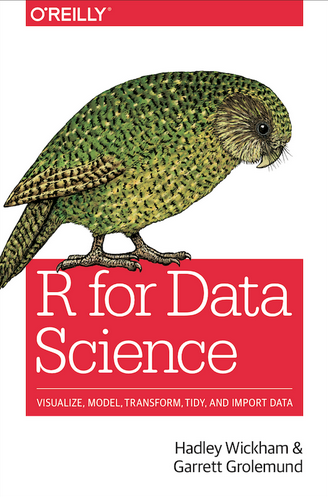
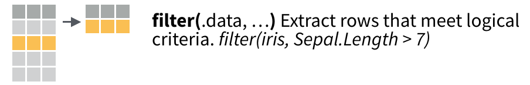
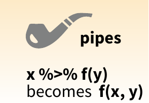
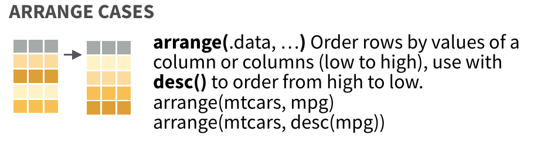
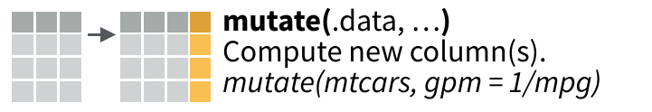
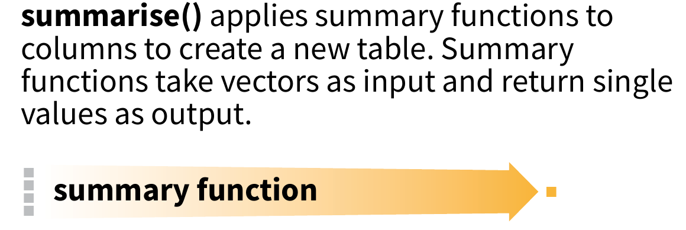
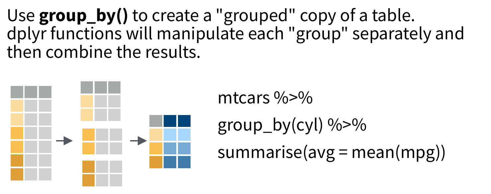

```{r setup, echo = F}
knitr::opts_chunk$set(warning = F, message = F)
```

# Resources

.pull-left[
[R for Data Science](https://r4ds.had.co.nz/)

[rstudio cheat sheets](https://www.rstudio.com/resources/cheatsheets/)
]

.pull-right[

]
---

# Load Packages

```{r}
# load 'gapminder' package containing demographic data
library(gapminder)

# load 'dplyr' package for manipulating data 
library(dplyr)

```

---

# Look at the data

```{r}
#look at gapminder
gapminder
```

--

## How many observations are in the gapminder dataset?

---

# The Filter Verb



--

# The Pipe



---

# Filtering

```{r}
gapminder %>%
  filter(year == 2007)
```

---

# Let's Review

+ '%>%' is a pipe

--

+ '==' means 'is this equal?' (test)

--

+ '=' means 'set this equal' (assignment)

--

## How many rows are in the filtered data?

--

<span style="font-size: 200%">142</span>

---

# Filtering by string

```{r}
gapminder %>%
  filter(country == "United States")
```
--
+ It's important to use quotes around this filter

---

# Filtering by Two Variables

```{r}
gapminder %>%
  filter(year == 2007, country == "United States")
```
--
* each statement within '()' separated by comma is called an argument

---

#  The Arrange verb



---

# Arrange by Variable

```{r}
gapminder %>%
  arrange(gdpPercap)
```

---

# Arrange by Variable

* you can use `desc` to sort in reverse order

--

```{r}
gapminder %>%
  arrange(desc(gdpPercap))
```


---

# Filter and Arrange

```{r}
gapminder %>%
  filter(year == 2007) %>%
  arrange(desc(gdpPercap))
```

* The pipe `%>%` is useful for combining operations together

---

# The Mutate Verb



* used to add a new variable
* or change a variable based on the value of another

---

# Change an existing variable

```{r}
gapminder %>%
  mutate(pop = pop / 1000000)
```

---

# Add a new variable

```{r}
gapminder %>%
  mutate(gdp = gdpPercap * pop)
```

* column names need to be one word (no spaces!)

---

#  Combining Verbs

Which countries had the highest gdp in 2007?

--

```{r}
gapminder %>%
  mutate(gdp = gdpPercap * pop) %>% # create gdp column
  filter(year == 2007) %>% # filter by year
  arrange(desc(gdp)) # sort by gdp
```

---

# The Summarize verb



---

### What is the average life expectancy across all countries and years?

--

```{r}
gapminder %>%
  summarize(meanLifeExp = mean(lifeExp))
```

---

### What is the average life expectancy across all countries in 2007?

--

### combine with `filter`!

--

```{r}
gapminder %>%
  filter(year == 2007) %>%
  summarize(meanLifeExp = mean(lifeExp))
```

---

### What is the average life expectancy and total population across all countries in 2007?

--


### add another summary using a different function, `sum`

--

```{r}
gapminder %>%
  filter(year == 2007) %>%
  summarize(meanLifeExp = mean(lifeExp),
            totalPop = sum(pop)) #<<
```

---

# Functions you can use for summarizing


`mean`

`sum`

`median`

`min`

`max`


---

# The group_by verb

What is the average life expectancy and total population across all countries in each year?

--

How do we tell R to __iterate__ by year?

--

Use `group_by`!

--


---


```{r}
gapminder %>%
  group_by(year) %>% #<<
  summarize(meanLifeExp = mean(lifeExp),
            totalPop = sum(pop)) 
```

---

What is the average life expectancy and total population __for each continent__ across all years?

--

```{r}
gapminder %>%
  group_by(continent) %>% #<<
  summarize(meanLifeExp = mean(lifeExp),
            totalPop = sum(pop))
```

---

What is the average life expectancy and total population for each continent __for each year__?

--

```{r}
gapminder %>%
  group_by(year, continent) %>% #<<
  summarize(meanLifeExp = mean(lifeExp),
            totalPop = sum(pop))
```


